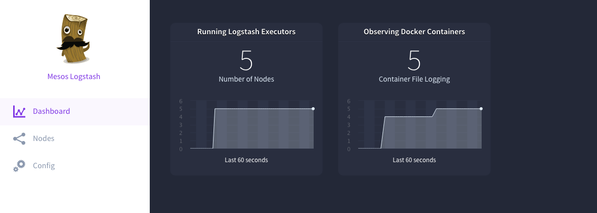
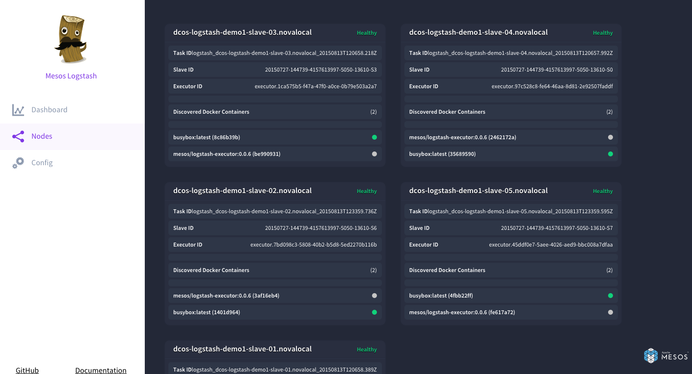
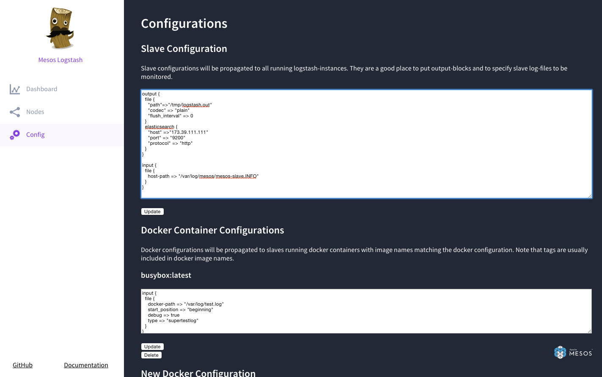

# Logstash Mesos Framework

A [Mesos](http://mesos.apache.org/) framework for running logstash in your cluster.
You can configure logging for all your other frameworks and have logstash parse and send
your logs to ElasticSearch.

## Overview

This framework will try to launch a logstash-process per slave.

# Roadmap

## Version 1 - July 24th

- ☑ Automatic discovery of running frameworks, streaming logs from files inside the containers. (This feature has since been removed.)
- ☑ Shared Test- and Development- Setup with `mesos-elasticsearch`, `mesos-kibana`
- ☑ External LogStash Configuration (config files propagated from Master to Slaves)
- ☑ Support for outputting to Elastic Search
- ☑ Basic Error Handling
- ☑ Installation Documentation
- ☑ Design Documentation
- ☑ Configuration GUI
- ☑ REST API for managing Configurations

## Version 2 - Aug 14th

- ☑ Basic Failover Handling with Zookeeper
- ☑ Allow reconfiguring running frameworks
- ☑ Basic DCOS compliance (Alpha stage)

## Version 3 - ?

- ☐ DCOS certification
- ☐ Loss-less logging. Thoroughly ensure that no log messages are lost. (e.g. when a container has rolling log files)
- ☐ Enhanced Error and Failover Handling
- ☐ Support for streaming output from `docker log`
- ☐ Support for arbitrary Logstash Plugins
- ☐ Service Discovery (allow frameworks to discover the log service automatically, and configure themselves)


## Requirements

Mesos 0.22.1 (or compatible).

### Access to Docker Host

Since the executor runs inside its own docker container it will try to reach its host using:
`http://<slavehostname>:2376`.


## Running as Marathon app

To run the logstash framework as a Marathon app use the following app template (save e.g. as logstash.json):
Update the JAVA_OPTS attribute with your Zookeeper servers.

 ```
 {
   "id": "/logstash",
   "cpus": 1,
   "mem": 1024.0,
   "instances": 1,
   "container": {
     "type": "DOCKER",
     "docker": {
       "image": "mesos/logstash-scheduler:0.0.6",
       "network": "HOST"
     }
   },
   "env": {
     "JAVA_OPTS": "-Dmesos.logstash.framework.name=logstash_framework -Dmesos.zk=zk://<zkserver:port>,<zkserver:port>/mesos"
   }
 }
 ```
 
 Note: See <a href="#fw_configuration">Framework options</a> for all available options.
 
 Please keep in mind that if you start the Logstash app as a Marathon app that this will start a 
 scheduler on one arbitrary slave. The scheduler itself will try to start one (only one) executor 
 on each node. To scale the application from within marathon makes no sense because only one scheduler
 per framework is allowed to run and the framework scales itself to all slaves.  

## Running as DCOS app

To run the logstash framework as a DCOS app:

Add our logstash repository to DCOS:
```
dcos config append package.sources "https://github.com/triforkse/universe/archive/version-1.x.zip"
```

update DCOS:
```
dcos package update
```

and install the package
```
dcos package install --options=logstash-options.json logstash
```

the `logstash-options.json`-file in the above example is where you can configure
logstash with your own settings. An example can be found <a href="https://github.com/mesos/logstash/tree/master/dcos/logstash-options.json">here</a>.
See <a href="#fw_configuration">Framework options</a> for an explanation of the available configuration parameters.
 
Note: **Uninstalling the logstash DCOS package will shutdown the framework! See [Updating to new version](#newversion) how to preserve the your logstash slave and docker configuations.** 

## <a name="newversion"></a>Updating to a newer version (or reinstalling the app)

When reinstalling, you must manually go into your zookeeper ui and remove the path `/logstash/frameworkId`.
This is so that the reinstalled app will be able to register without losing the logstash docker and slave configurations.
 

## <a name="gui"></a> GUI

The GUI allows you to monitor the health of the cluster, see what is currently streaming and which
nodes have executors deployed.

The GUI is available whenever the scheduler is running. It can be accessed using HTTP through port `9092` on the
mesos slave where the scheduler is running.

### Dashboard



The `Running Logstash Executors` shows the number of slaves where the framework (executors) is running on.
Usually that should match your number of slaves.

The `Observing Docker Containers` shows the number of docker containers logstash is actually observing log files from.
E.g. you've configured a docker configuration for two frameworks. And these framework are running let's say 4 and 5 docker containers 
somewhere in the cluster then 4+5=9 observing docker containers should be displayed.
 
### Nodes



Here you see some detailed information about the slaves where the logstash framework is running on.
Slaves hostnames and some Mesos specfic information like TaskID and ExecutorID are shown.

Further you see all docker running containers discovered by the logstash framework and their image names.
That doesn't mean that logstash is currently observing log files from each docker container shown. 
Whether the logstash framework is observing log files from within these containers is indicated by a 
green bubble (see at the screenshot above). A gray bubble means that no files are monitored from within the container.

The status at the top right corner gives you a hint whether your logstash configuration could be successfully applied. 
If it's not `healthy` you should test your logstash configuration. 

Note: Currently there is no indication whether you monitoring file from the slave itself.     
    
### Config



Here you can actually configure the slave and docker container configuration. See next section.

## <a name="configuration"></a> Configuration

There are two different types of configurations that can be supplied to logstash-mesos.
They are both based on the [same configuration language](https://www.elastic.co/guide/en/logstash/current/configuration.html) as logstash,
 but adds some custom behaviour because of the fact that it is running inside a mesos executor.
 
The [scheduler's web UI](#gui) will provide a helpful interface for configuring logstash-mesos the way you want.

### Slave Configuration
Slave (or "Host") configurations will be propagated to all running logstash-instances. They are a good place to put output-blocks and to specify slave log-files to be monitored.
You can use the special key 'host-path' to configure file-plugins inside logstash input-blocks to indicate that a file should be logged from the slave itself (instead of the executor's docker container).
Example:
```
input { file { "host-path" => "/var/log/hello.log" } }
```
This will configure logstash to monitor the file `/var/log/hello.log` on all slaves. Note: this requires that the logstash framework is configured to use `/var/log` as a volume.

### Docker Configuration
Docker configurations will be propagated to slaves running docker containers with image names matching the docker configuration. Note that tags are usually included in docker image names.

Example: a slave running a docker container with the nginx:latest docker image will be provided a docker configuration with 'applicable image name' set to nginx:latest, if it exists.

You can use the special key 'docker-path' to configure file-plugins inside logstash input-blocks to indicate that a file should be logged from within the docker container itself.

Example:
```
input { file { "docker-path" => "/var/log/hello.log" } }
```

This will configure logstash to monitor the file `/var/log/hello.log` inside all applicable docker containers.

## <a name="fw_configuration"></a> Framework options

The available DCOS configuration options are documented in JSON [here](https://github.com/triforkse/universe/blob/version-1.x/repo/packages/L/logstash/0/config.json).

When running the scheduler directly (i.e from the command line or as a marathon app) you can use the corresponding java system properties.
You can refer to [marathon.json](https://github.com/triforkse/universe/blob/version-1.x/repo/packages/L/logstash/0/config.json) to see how the DCOS parameters
are translated to system properties.


## REST API

Along with the GUI there is a RESTful API available. Currently is is only enabled if you also run the
GUI.

The available endpoints are:

```
GET /api/configs
```

Returns an array of configurations. (See format below)
The new framework will be available at `api/configs/{name}`.

```
POST /api/configs
```

Creates a new configuration for a framework. (See format below)

```
PUT /api/configs/{framework-name}
```

Updates an existing framework config. Please make sure that framework-name is proper URL encoded (e.g. in JavaScript see `encodeURIComponent`)

// TODO: Write about native config endpoints.

__Expected Format__

```js
{
    "name": "String", // The name of the docker image to match when,
    "input": "String" // The Logstash configuration segment for this framework.
}
```

```
DELETE /api/configs/{framework-name}
```

Removes the configuration for this framework. Please make sure that framework-name is proper URL encoded (e.g. in JavaScript see `encodeURIComponent`)

# Technical Details

The mesos-logstash framework is written in Java (Version 8).

## Build the framework

Compilation

```
./gradlew --info clean compileJava
```

System test

```
echo "schedulerImageName=mesos/logstash-scheduler" > local.properties
echo "executorImageName=mesos/logstash-executor" >> local.properties
./gradlew -a --info clean build :system-test:test
```

## Run the Tests

To run the tests locally you need to fulfill the following requirements:

- Java Development Kit installed (Java 8)
- Docker daemon running (either locally or using e.g. [Docker-Machine](https://docs.docker.com/machine/))

If your Docker daemon is not running natively on your machine
(e.g. on a Mac or if you're using docker-machine) you have
to export the DOCKER_* variables (e.g. for docker-machine use `eval $(docker-machine env dev)`).

Run `gradle test` to run the all tests.  

### Routes

When testing against non-local docker host (e.g docker-machine, boot2docker)
you will need to add a route to get the tests to run.

The reason is to allow the scheduler, which runs outside of docker when testing, to
communicate with the rest of the cluster inside docker.

This command:
```
sudo route -n add 172.17.0.0/16 $(docker-machine ip dev)
```
Sets up a route that allows packets to be routed from your scheduler (running locally on your
computer) to any machine inside the subnet `172.17.0.0/16`, using your docker host as gateway.

# Limitations

Log files will be streamed into local files within the logstash-mesos container.
This requires disk space
which is hard to estimate beforehand, since it depends on the number of available log files.

The intention is to do a best guess when allocating resources from Mesos (Work in Progress).

# Security

There is no mechanism which ensures that the logstash output might overlap with other
logstash configurations. In other words: logstash might observe one framework
and output to the same destination it's using for another framework. 

# Sponsors

This project is sponsored by `Cisco Cloud Services`. Thank you for contributing to the Open Source
community!

